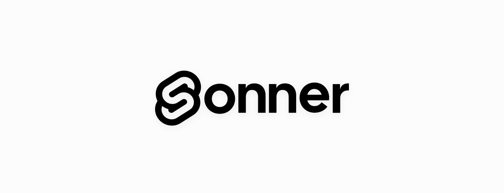

<p align="center">

</p>
<p align="center">


</p>
<p align="center">
<a href="https://sonner-svelte.vercel.app">Website</a> · <a href="https://npmjs.com/package/sonner-svelte">NPM Package</a>
</p>

# sonner-svelte

> An opinionated toast notification library for Svelte.

`svelte-sonner` is a svelte port of Emil Kowalski's react library `sonner`

## Installation

```bash
# npm
npm install sonner-svelte
# pnpm
pnpm add sonner-svelte
# yarn
yarn add sonner-svelte
```

## Basic Usage

```html
<script>
import { toast, Toaster } from 'sonner-svelte';

function handleClick() {
    toast('This is a toast message')
}
</script>

<Toaster />
<button on:click={handleClick}>toast</button>
```

Add `<Toaster />` in your app root. This is where the toast notifications will be rendered. Then import `toast` and use it to show a toast notification.

For more examples, check out the [website](https://sonner-svelte.vercel.app/)

## Acknowledgements

Thanks to the original author [@emilkowalski](https://github.com/emilkowalski) for creating [sonner](https://github.com/emilkowalski/sonner)
